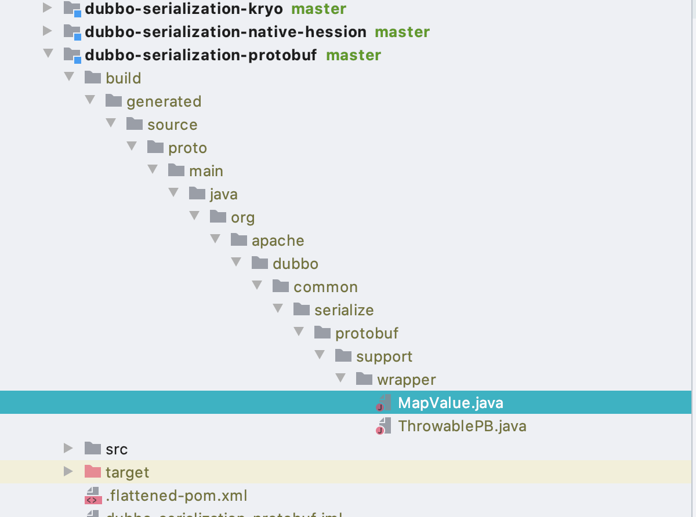
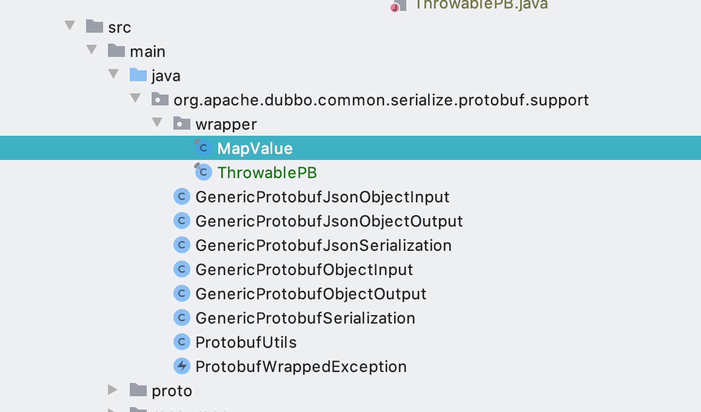

# 环境搭建
- 直接从GitHub上获取代码即可
##  小坑
- 执行`mvn clean package install ` 之后会缺少文件主要在`dubbo-serialization-protobuf`项目中
```java
import org.apache.dubbo.common.serialize.protobuf.support.wrapper.MapValue;
import org.apache.dubbo.common.serialize.protobuf.support.wrapper.ThrowablePB;
```
上面的两行代码没有对应的类,包也不存在,此时需要手动创建出来

编译后会直接创建出来



复制回去就好了

